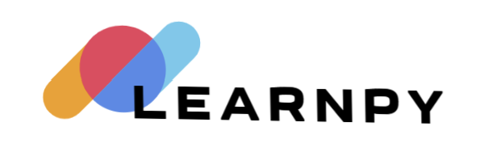

# 📌 LearnPy  
*A beginner-friendly Python learning platform with interactive content and a modern UI.*

 <!-- Add an actual banner image if available -->

---

## 📖 Overview  
**LearnPy** is a simple and engaging platform designed to help users learn Python through interactive lessons, exercises, and quizzes.

### 🚀 Features  
- ✅ Clean and responsive UI  
- ✅ Organized file structure  
- ✅ Interactive scripts using JavaScript  
- ✅ Modern styling with CSS  
- ✅ Favicon and assets included  

---

## 📂 Project Structure  
```sh

LearnPy/
│── assets/
│   ├── css/
│   │   ├── style.css
│   ├── images/
│   ├── js/
│   │   ├── script.js
│   ├── favicon.svg
│── index.html
│── index.txt
│── style-guide.md
│── README.md  <-- (This file)

```

---

## 🚀 How to Use  
1. **Clone the Repository**  
   ```sh
   git clone https://github.com/Sunilstar-V/LearnPy.git
   cd LearnPy
   ```
2. **Open index.html in a browser**
3. **Enjoy the Python learning experience! 🎉**

## 🌐 Live Demo
- If you plan to deploy it, add the link here:
**[🔗 Live Demo](https://skc-sunil-learnpy.netlify.app/)**

## 📜 License
- This project is licensed under the MIT License.

## 💡 Suggestions?
- Feel free to raise an issue or contribute via pull requests!
